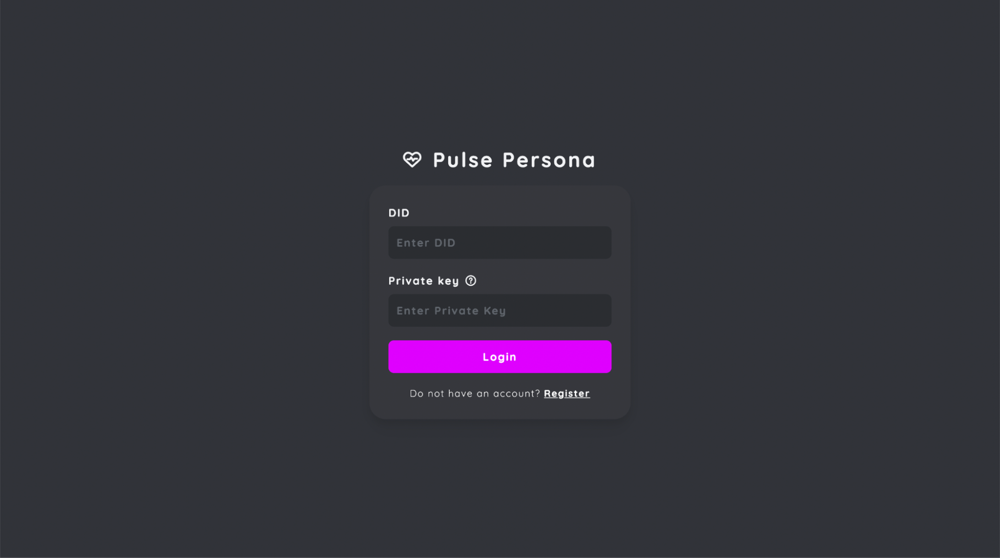
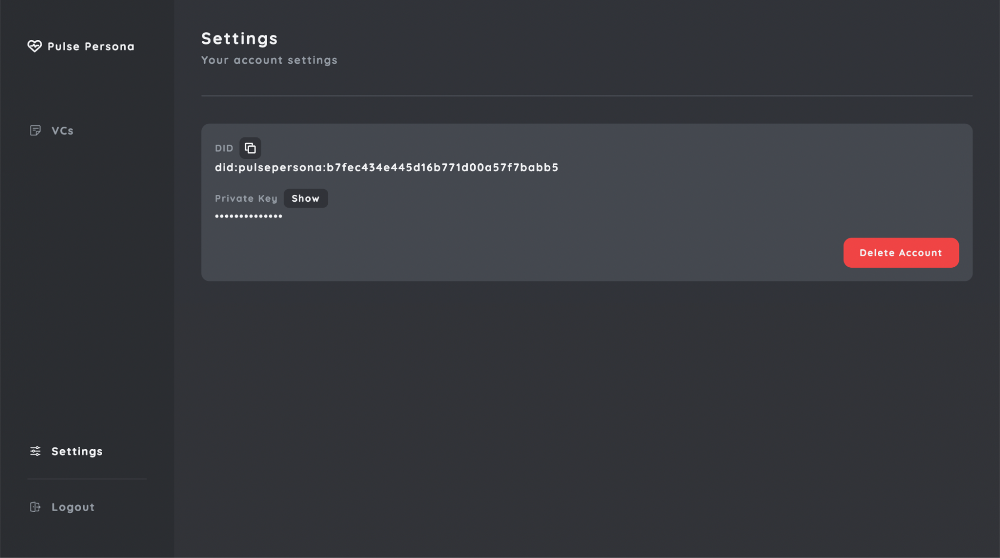
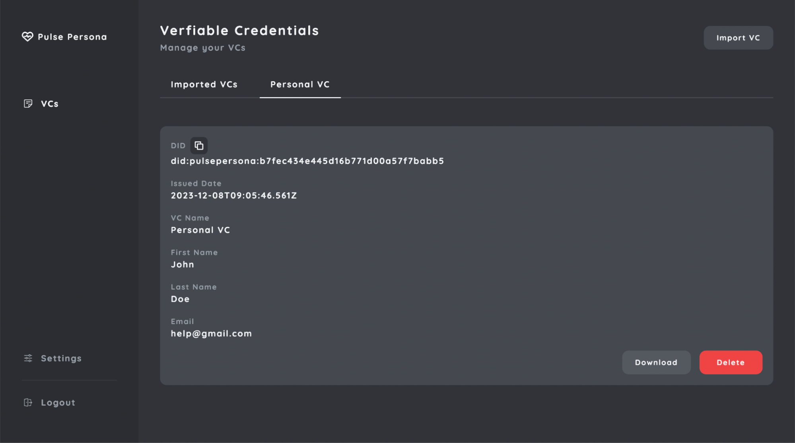

# PulsePersona

PulsePersona is a decentralized application (dApp) designed to empower users with control over their personal data and credentials through a secure and user-centric platform. Built upon the robust Ethereum blockchain, it leverages the InterPlanetary File System (IPFS) for decentralized data storage, ensuring that users' information remains accessible and tamper-resistant.

The essence of PulsePersona is captured in its name—a blend of 'pulse', symbolizing the vital, rhythmic essence of life, and 'persona', the aspect of an individual's character that is presented to or perceived by others. This synergy reflects our commitment to creating a platform where self-sovereign identity is as intrinsic and dynamic as the heartbeat itself.

At its core, PulsePersona embodies an identity system that resonates with the user's individuality, mirroring their personal beat within the digital ecosystem. The platform not only facilitates the active participation and representation of one’s digital self but does so with a commitment to maintaining the authenticity and vibrancy of user identities. With PulsePersona, your digital identity is poised to stay as lively and unique as your physical presence in the world.

## Technology Stack

- [Next.js](https://nextjs.org/) - React framework
- [Ethers.js](https://docs.ethers.org/v6/) - Javascript library to interact with the Ethereum Blockchain
- [Tailwind.css](https://tailwindcss.com/docs/) - CSS framework

## Getting Started

These instructions will get you a copy of the project up and running on your local machine for development and testing purposes.

The project is split into three parts: `issuer`, `verifier`, `wallet`. Each part contains a separate application that can be run independently and is aimed at representing a different user role in the context of self-sovereign identity (SSI).

This repository contains the fontend of PulsePersona--Wallet.

For the backend and other frontend, please refer to the following repositories:

- [Issuer](https://github.com/ffeew/PulsePersona_Issuer)
- [Verifier](https://github.com/ffeew/PulsePersona_Verifier)
- [Backend](https://github.com/ffeew/PulsePersona)

### Prerequisites

- [Node.js](https://nodejs.org/en/) - v18.17.0 or higher

### Installation

1. Clone the repository

```bash
git clone https://github.com/ffeew/PulsePersona_Wallet
```

2. Install NPM packages

```bash
npm install
```

3. Run the application

```bash
npm run dev
```

### Usage Manual

#### Registration


To register for a PulsePersona account, enter your email and your private key.

#### Login



To login to your PulsePersona account, enter your DID and your private key.

#### View account details



To View account details, click on the Settings tab. You can copy the did by clicking on the “copy” button or view your private key by clicking on the “view” button.

#### View & Import Verifiable Credentials


To View Verifiable Credentials, click on the Verifiable Credentials tab. To Import Verifiable Credentials, click on the "Import" button at the top right.

#### Generate Personal Verifiable Credential


To generate your personal Verifiable Credential, click on the “Generate” button. You will see the result below after generating, you can download or delete your VC.


